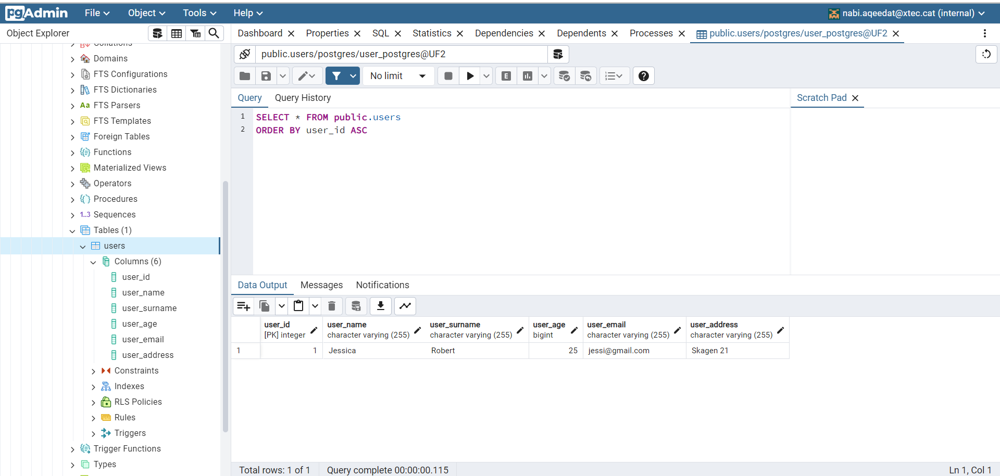

# M10_UF2
## * PRACTICA2 : 
### It includes CRUD operation : 
Checking the curson object and verifying connection : 

Verifying the creation of table : 

Make sure the table exists in PgAdmin4 : 

Making the insertion : 

Verifying the insertion : 

Reading the records of the table : 

Another insertion : 

Verifying 2nd insertion : 

Displaing records : 

Making modifications : 

Verifying modification of Jessica's age: 

Add a user and verify it before deleting it: 

Deleting a user : 

Verification after deleting : 

Menu check of creating table : 

Menu verify option 1 to add a new user : 

Verification option 2 : 

Verification option3 after Updating address : 

Verification after updating : 

Displaying all users & before deleting user-3 : 

Option 4 deleting user-3: 

Checking the users : 

Verification after deleting : 

Checking invalid options : 

Verification of exiting the program : 

## All CRUD operations held above.

